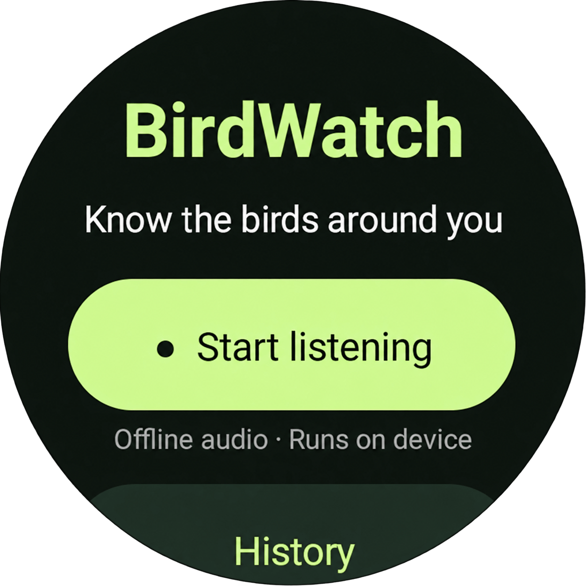
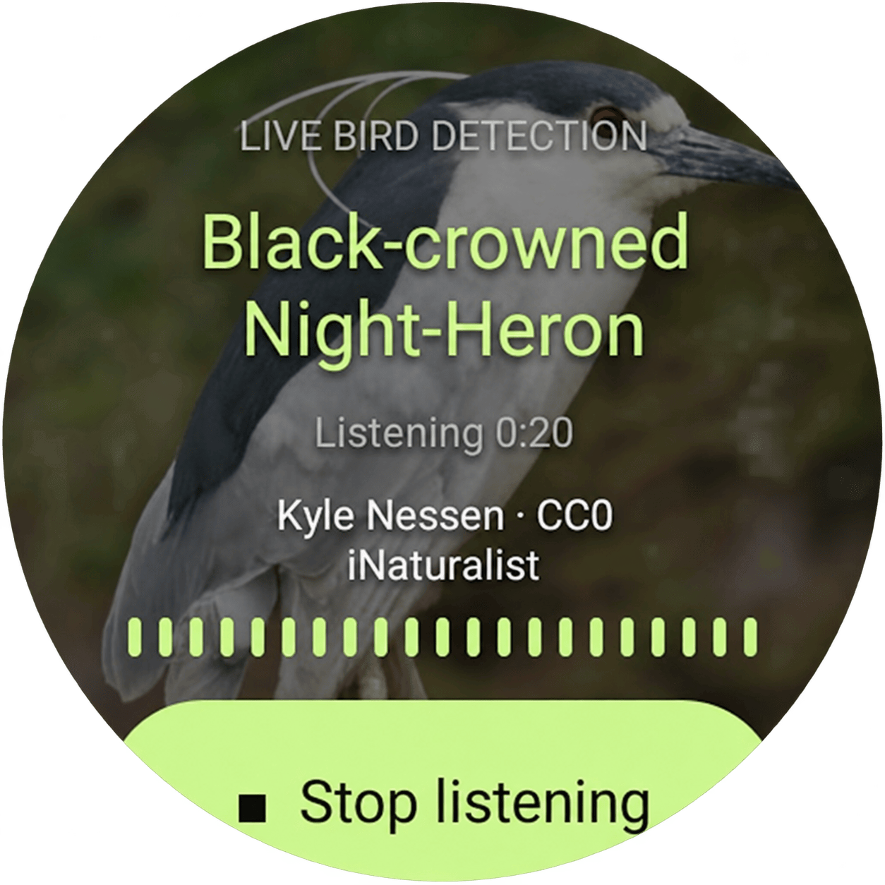

# BirdWatch

Simple app for sound-based bird detection on Android Watch using [BirdNet](https://github.com/birdnet-team/BirdNET-Analyzer). Detection is run on local and doesn't require network access.

